<div align="center">

# Arabic NLP Comparative Analysis Platform

### Capability-Aware Comparative Analysis, Transparent Evidence, and Expert Fusion for Arabic NLP

A research-oriented full-stack platform that runs multiple Arabic NLP analyzers, aligns their outputs, reveals agreement and conflict patterns, and produces explainable feature-level fusion decisions without pretending that analyzer agreement is the same as linguistic correctness.

<br/>

[](#technology-stack)
[](#technology-stack)
[](#technology-stack)
[](#technology-stack)
[](#supported-analyzers)
[](#research-positioning)
[](#evaluation-status)
[](#license)

<br/>

**Comparative Analysis · Token Alignment · Conflict Inspection · Capability-Aware Fusion · Explainable Decisions · Arabic NLP Research**

</div>

---

## Table of Contents

- [Project Overview](#project-overview)
- [Why This Project Exists](#why-this-project-exists)
- [What Makes It Different](#what-makes-it-different)
- [Project Demo](#project-demo)
- [Screenshots Gallery](#screenshots-gallery)
- [Core Capabilities](#core-capabilities)
- [Research Positioning](#research-positioning)
- [End-to-End Workflow](#end-to-end-workflow)
- [System Architecture](#system-architecture)
- [Backend Processing Pipeline](#backend-processing-pipeline)
- [Frontend Research Flow](#frontend-research-flow)
- [Supported Analyzers](#supported-analyzers)
- [Analyzer Status Matrix](#analyzer-status-matrix)
- [Capability-Aware Comparison](#capability-aware-comparison)
- [Expert Fusion](#expert-fusion)
- [Decision Trace](#decision-trace)
- [Confidence Interpretation](#confidence-interpretation)
- [Analyze Module](#analyze-module)
- [Compare Module](#compare-module)
- [Fusion Module](#fusion-module)
- [Evaluation Status](#evaluation-status)
- [Technology Stack](#technology-stack)
- [Repository Structure](#repository-structure)
- [Installation](#installation)
- [Environment Setup](#environment-setup)
- [Running the Platform](#running-the-platform)
- [API Documentation](#api-documentation)
- [Large Local Resources](#large-local-resources)
- [Reproducibility Notes](#reproducibility-notes)
- [Known Limitations](#known-limitations)
- [Research Contributions](#research-contributions)
- [Future Work](#future-work)
- [Citation](#citation)
- [Authors and Collaboration](#authors-and-collaboration)
- [License](#license)

---

# Project Overview

The **Arabic NLP Comparative Analysis Platform** is a research-oriented full-stack application for inspecting the outputs of multiple Arabic Natural Language Processing analyzers through one unified interface.

The platform accepts Arabic text, runs several analyzers with different capabilities, normalizes their outputs, aligns comparable token evidence, highlights agreements and conflicts, and produces an explainable expert-fusion decision for supported linguistic features.

The project is intentionally designed as a **research workbench**, not as a black-box “best analyzer” selector.

Its central idea is simple:

> Different Arabic NLP analyzers are strong at different tasks, use different tokenization conventions, expose different feature sets, and may disagree for valid technical reasons.

For that reason, the system does not treat all tools as interchangeable and does not score unsupported outputs as errors.

---

# Why This Project Exists

Arabic NLP analysis is difficult for several reasons:

- Arabic words may include attached clitics.
- Tokenization strategies differ across tools.
- Lemma and root conventions are not always identical.
- POS tag sets may follow different schemas.
- Morphological analyzers and dependency parsers solve different problems.
- Some tools are contextual while others are lexical or rule-based.
- Some analyzers require Java resources, local models, or licensed packages.
- A tool may support one feature strongly and another feature weakly or not at all.

A direct side-by-side comparison without normalization can therefore be misleading.

This platform addresses that problem by introducing:

1. **Adapter-based analyzer integration**
2. **Shared normalization**
3. **Token alignment**
4. **Feature-aware comparison**
5. **Capability-aware contributor selection**
6. **Explainable expert fusion**
7. **Transparent exclusion rules**

---

# What Makes It Different

## 1. It compares evidence instead of hiding disagreement

The platform does not collapse all analyzer outputs into one answer immediately.

It first shows:

- Which tools produced evidence
- Which tools support the requested feature
- Which values agree
- Which values conflict
- Which tools were unavailable, excluded, or unsupported
- Which values were selected for fusion

## 2. It does not assume one analyzer is best for everything

The fusion layer is feature-specific.

For example:

- Farasa is used primarily as a segmentation specialist.
- CAMeL Tools provides strong morphology, lemma, root, POS, and gloss evidence.
- Stanza and UDPipe provide syntax and Universal Dependencies evidence.
- AlKhalil contributes rule-based morphology and root evidence.
- Qalsadi contributes lemma-oriented lexical support.
- SinaTools contributes local lexical evidence when loaded.
- AraBERT is treated as contextual support only unless a task-specific head is available.

## 3. It keeps the fusion decision auditable

Each selected value can preserve:

- Selected source
- Candidate values
- Supporting tools
- Disagreeing tools
- Strategy
- Confidence summary
- Decision trace

## 4. It avoids false evaluation claims

The platform distinguishes between:

- **Agreement**
- **Coverage**
- **Availability**
- **Capability**
- **Correctness**

Agreement is useful research evidence, but it is not the same as gold-standard accuracy.

---

# Project Demo

## Video Demonstration

The project includes a local MP4 demonstration:

[`docs/demo/demo-nlp.mp4`](docs/demo/demo-nlp.mp4)

> GitHub may open the video as a file rather than playing it inline inside the README. The link above points directly to the repository asset.

## Suggested Public Demo Options

For a more portfolio-friendly experience, the same video can later be uploaded to:

- GitHub Releases
- YouTube (unlisted or public)
- Google Drive
- A personal portfolio page

Then the README can link to the hosted version.

---

# Screenshots Gallery

## Platform Overview

The overview page presents the research purpose, available tools, supported task categories, and navigation flow.

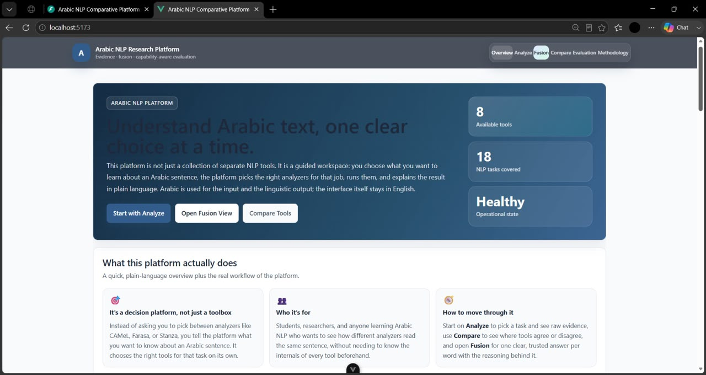

---

## Analyze Input

The Analyze module is task-oriented: the user selects the linguistic objective before compatible analyzers are executed.

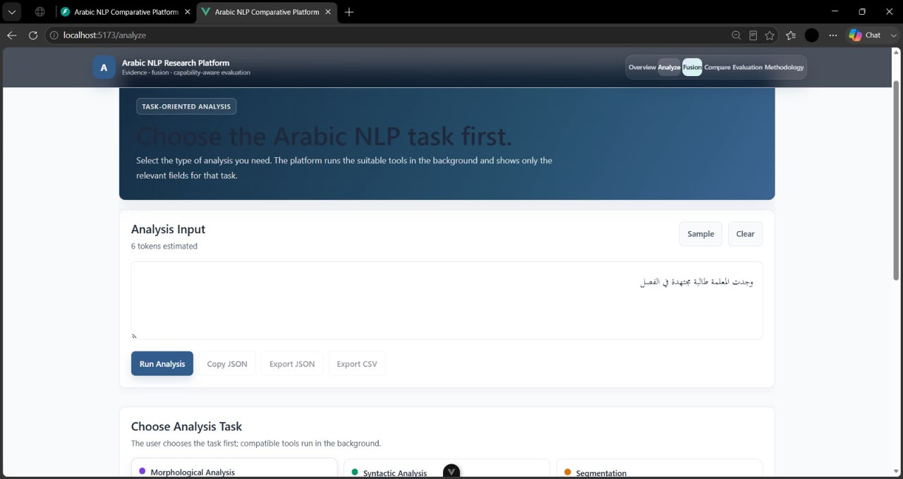

---

## Analyze Task Selection

The interface presents task categories such as morphology, syntax, segmentation, POS tagging, lemmatization, root extraction, and full comparative analysis.

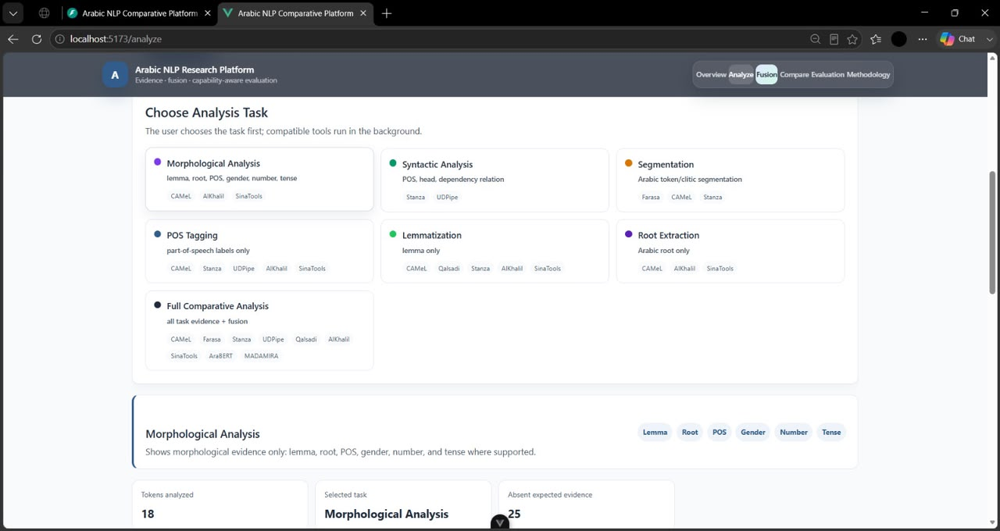

---

## Analysis Results

The platform shows the evidence returned by analyzers relevant to the selected task.

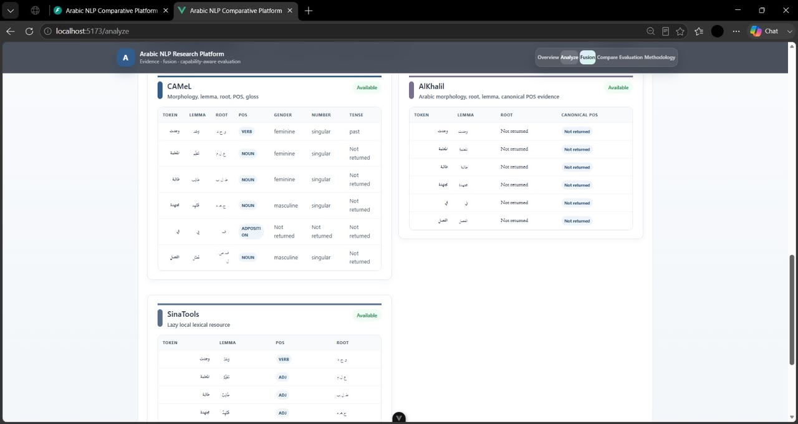

---

## Compare Input

The Compare module accepts Arabic text and prepares aligned analyzer evidence.

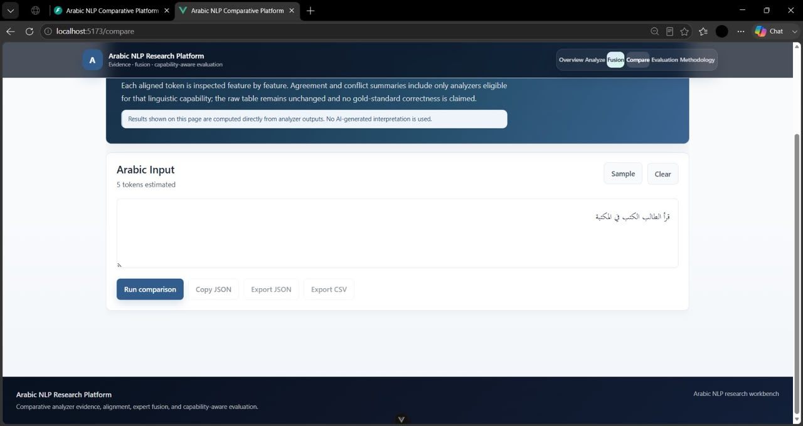

---

## Compare Results — Capability Summary

The comparison view reports aligned tokens, displayed analyzers, capability-eligible conflicts, and comparable token-feature pairs.

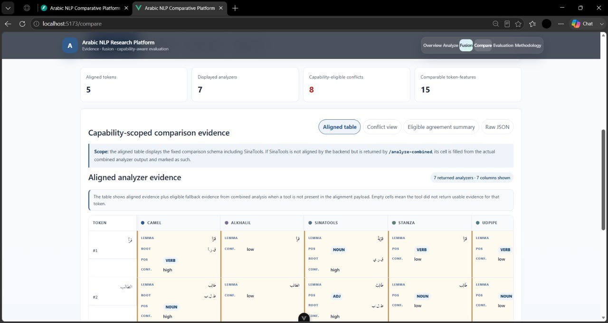

---

## Compare Results — Aligned Evidence Table

The aligned evidence table presents comparable analyzer outputs under a shared schema.

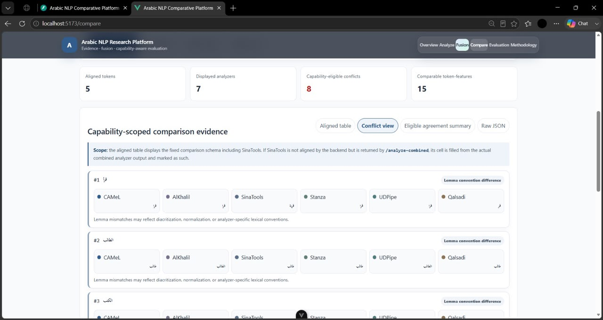

---

## Fusion Input

The Fusion page routes each linguistic feature to eligible analyzers and exposes the participating tools.

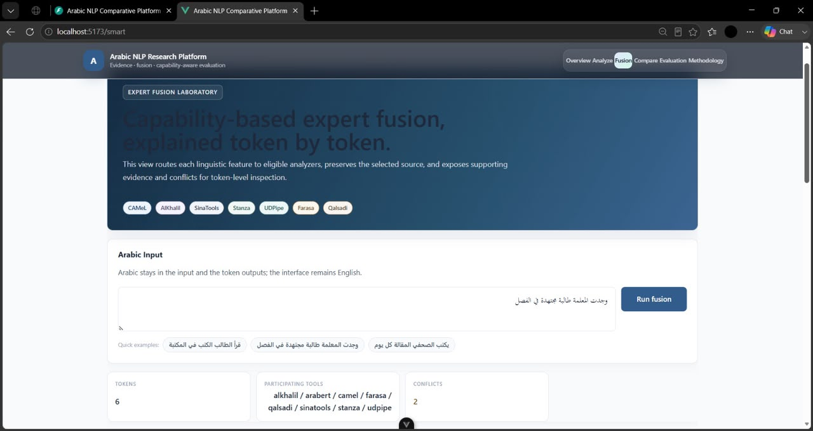

---

## Fusion Results

The fused token table shows selected lemma, root, POS, segmentation, and source assignments.

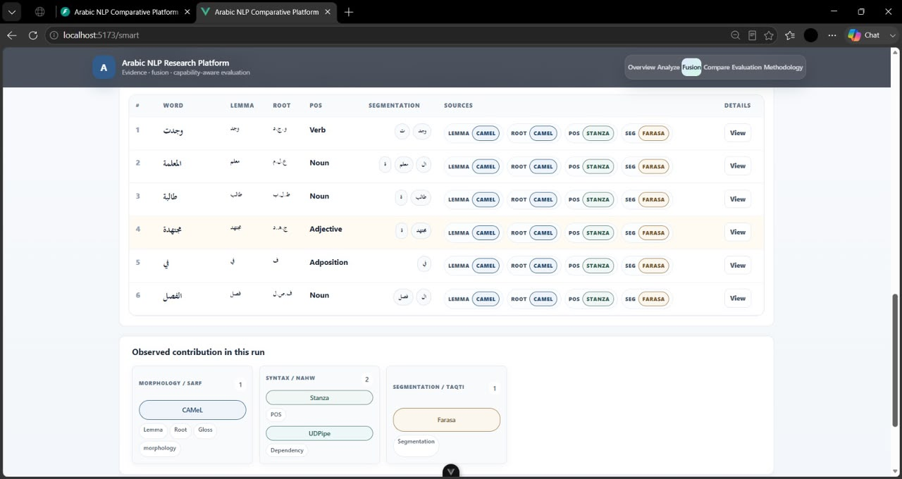

---

## Fusion Details and Decision Trace

The detailed fusion view exposes eligible analyzer evidence and the reasoning behind selected values.

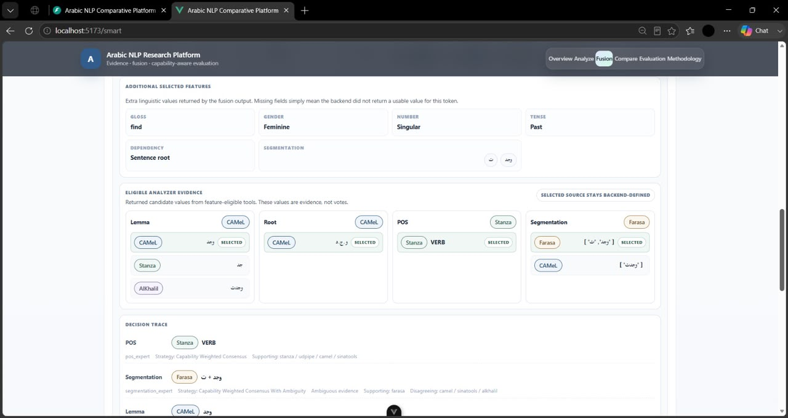

---

# Core Capabilities

## Multi-Analyzer Execution

The backend can run several Arabic NLP analyzers behind a shared application layer.

## Shared Output Schema

Analyzer-specific responses are normalized into a common structure.

## Token Alignment

Outputs are aligned to support comparison across different tokenization strategies.

## Capability Filtering

Only analyzers that support a feature are treated as eligible contributors for that feature.

## Conflict Detection

The comparison engine identifies incompatible values among comparable analyzers.

## Expert Fusion

Feature-level fusion selects values using capability-aware strategies rather than one global priority order.

## Transparent Exclusions

Unsupported, lazy-loaded, unavailable, timeout, degraded, or excluded tools are documented rather than silently counted as wrong.

## Export

The project supports structured output and export-oriented workflows through backend endpoints and frontend controls.

---

# Research Positioning

This project should be interpreted as a **comparative evidence platform**.

It currently supports:

- Analyzer inspection
- Agreement analysis
- Conflict inspection
- Capability-aware fusion
- Methodology documentation
- Research visualization

It does not currently claim:

- Gold-standard accuracy
- Human-level linguistic correctness
- State-of-the-art benchmark performance
- Universal superiority over individual analyzers
- Finalized evaluation results

---

# End-to-End Workflow

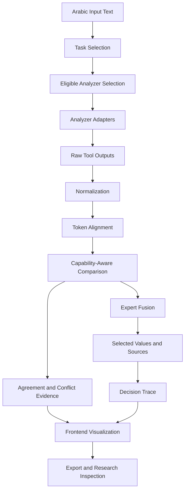

---

# System Architecture

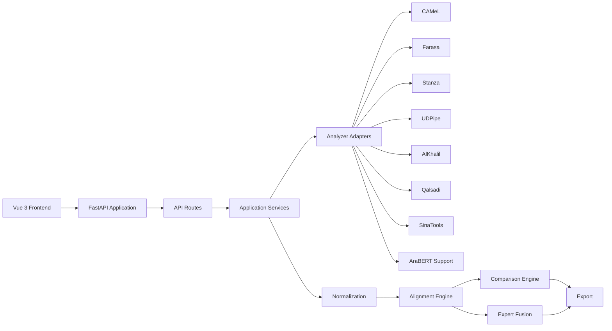

---

# Backend Processing Pipeline

The backend follows an adapter-and-service structure.

## Analyzer Adapter Layer

Each tool is isolated behind its own wrapper or adapter.

The adapter layer is responsible for:

- Loading the tool
- Handling tool-specific input requirements
- Converting raw outputs into a predictable schema
- Reporting availability and status
- Preserving tool-specific evidence where necessary

## Normalization Layer

Normalization reduces avoidable incompatibility by standardizing:

- Field names
- Empty values
- POS representations
- Morphological labels
- Token metadata
- Source identifiers

## Alignment Layer

The alignment engine maps analyzer outputs onto a shared token interpretation.

Alignment is essential because tools may differ in:

- Clitic segmentation
- Multi-word token handling
- Punctuation treatment
- Token count
- Whitespace normalization
- Dependency tokenization

## Comparison Layer

The comparison engine evaluates comparable fields only.

It can report:

- Matching values
- Conflicting values
- Missing evidence
- Unsupported evidence
- Contributing tools
- Excluded tools

## Fusion Layer

The fusion layer selects feature values using feature-specific strategies.

## Evaluation Layer

The evaluation architecture exists, but the benchmark-driven evaluation module is still under development.

---

# Frontend Research Flow

The Vue frontend is organized around a research narrative:

```text
Overview
   ↓
Analyze
   ↓
Fusion
   ↓
Compare
   ↓
Evaluation
   ↓
Methodology
```

## Overview

Explains the project purpose, available tools, and platform workflow.

## Analyze

Allows the user to select an NLP task and inspect relevant analyzer outputs.

## Fusion

Shows selected values, selected sources, supporting analyzers, conflicts, and decision traces.

## Compare

Displays aligned analyzer evidence and capability-scoped conflicts.

## Evaluation

Reserved for agreement metrics and future benchmark evaluation.

## Methodology

Documents interpretation rules and research limitations.

---

# Supported Analyzers

The platform integrates or documents the following Arabic NLP systems.

## CAMeL Tools

**Primary capabilities**

- Morphology
- Lemma
- Root
- POS
- Gloss
- Arabic token processing

**Role in the platform**

CAMeL Tools is one of the primary lexical and morphological evidence providers.

**Research note**

Its rich morphological output makes it useful for fusion, but labels still require normalization before cross-tool comparison.

---

## Farasa

**Primary capability**

- Arabic clitic segmentation

**Role in the platform**

Farasa acts mainly as the segmentation specialist.

**Runtime note**

Farasa is Java-backed and may require local binaries or JAR files.

**Repository note**

Large Farasa binaries are intentionally excluded from Git tracking and must be installed locally.

---

## Stanza

**Primary capabilities**

- Tokenization
- POS tagging
- Lemmatization
- Universal Dependencies
- Dependency parsing

**Role in the platform**

Stanza contributes contextual POS and syntax evidence.

**Research note**

Its tokenization and multi-word token behavior can differ from morphology-focused tools.

---

## UDPipe

**Primary capabilities**

- POS tagging
- Lemmatization
- Universal Dependencies
- Dependency parsing

**Role in the platform**

UDPipe acts as a syntax specialist and provides comparison evidence alongside Stanza.

---

## AlKhalil

**Primary capabilities**

- Rule-based morphology
- Lemma
- Root
- POS evidence

**Role in the platform**

AlKhalil is useful for rule-based morphology and root-oriented evidence.

**Technical note**

Local Java integration and encoding normalization may require special configuration.

---

## Qalsadi

**Primary capabilities**

- Lemmatization
- Lexical support
- Rule-based analysis

**Role in the platform**

Qalsadi is mainly used as lemma support or fallback evidence.

---

## SinaTools

**Primary capabilities**

- Lemma
- Root
- POS lexical evidence

**Role in the platform**

SinaTools contributes local lexical evidence when its resource is loaded.

**Runtime note**

The project may expose statuses such as:

- `lazy_not_loaded`
- `loading`
- `available`

**Repository note**

Large local resources such as lemma dictionaries may be excluded from Git.

---

## AraBERT

**Primary capability**

- Contextual transformer representations

**Role in the platform**

AraBERT is contextual support only in the current version.

**Important limitation**

Base AraBERT does not directly provide:

- Lemma
- Root
- POS
- Segmentation
- Dependency relations

without a fine-tuned task-specific head.

For that reason, it should not contribute directly to unsupported evaluation metrics.

---

## MADAMIRA

**Potential capabilities**

- Morphological analysis
- Disambiguation
- Lemma
- POS
- Segmentation

**Current status**

Excluded in the current setup because required licensed resources are not included.

**Research note**

The project should not claim operational MADAMIRA support unless the required resources are legally installed.

---

# Analyzer Status Matrix

| Analyzer | Current Status | Main Capabilities | Fusion Role | Comparison Role | Important Notes |
|---|---|---|---|---|---|
| CAMeL | Working | Morphology, lemma, root, POS, gloss | Primary morphology and lexical evidence | Yes | Rich output requires normalization |
| Farasa | Working locally | Segmentation | Segmentation specialist | Yes, when available | Java-backed; large binaries excluded |
| Stanza | Working | POS, lemma, dependency | Syntax and contextual POS | Yes | UD tokenization may differ |
| UDPipe | Working | POS, lemma, dependency | Syntax support | Yes | Useful alongside Stanza |
| AlKhalil | Working locally | Morphology, lemma, root, POS | Rule-based support | Yes | Java and encoding considerations |
| Qalsadi | Working partial | Lemma, lexical support | Lemma support | Yes, where comparable | Limited feature coverage |
| SinaTools | Lazy-loaded | Lemma, root, POS | Lexical support | Yes, when loaded | Heavy local resource |
| AraBERT | Contextual support only | Contextual embeddings | No direct morphology fusion | Excluded from unsupported metrics | Requires fine-tuned heads |
| MADAMIRA | Excluded | Morphology and disambiguation | No | No | Licensed resources missing |

---

# Capability-Aware Comparison

A simple comparison can be misleading when one analyzer does not support the requested feature.

For example:

- A dependency parser should not be penalized for not returning an Arabic root.
- A morphology tool should not be treated as a dependency parser.
- A contextual transformer should not be counted as wrong for not returning a lemma if no task-specific head exists.

The platform therefore uses capability-aware comparison.

## Eligibility Principle

An analyzer is eligible for a feature only when:

1. The tool supports the feature.
2. The tool is available.
3. The tool produced usable evidence.
4. The tool is not excluded for licensing or runtime reasons.
5. The output is comparable after normalization.

## Example

For root comparison:

- CAMeL may contribute.
- AlKhalil may contribute.
- SinaTools may contribute if loaded.
- Stanza should not be treated as a root analyzer.
- AraBERT should not be counted as a failed root analyzer.

## Comparison Outputs

The comparison module can report:

- Number of aligned tokens
- Displayed analyzers
- Comparable token-feature pairs
- Capability-eligible conflicts
- Agreement summaries
- Raw aligned evidence
- Missing and unsupported evidence

---

# Expert Fusion

Expert Fusion is the central research contribution of the platform.

It replaces a single global priority order with feature-specific selection.

## Fusion Philosophy

The system asks:

> Which analyzer is most appropriate for this linguistic feature, under the current evidence and availability conditions?

rather than:

> Which analyzer is globally ranked first?

## Feature-Specific Strategy

### Segmentation

Preferred evidence:

- Farasa
- CAMeL support
- Other morphology tools when relevant

### Lemma

Potential contributors:

- CAMeL
- Qalsadi
- Stanza
- UDPipe
- AlKhalil
- SinaTools

### Root

Potential contributors:

- CAMeL
- AlKhalil
- SinaTools

### POS

Potential contributors after normalization:

- Stanza
- UDPipe
- CAMeL
- AlKhalil
- SinaTools

### Dependency

Preferred contributors:

- Stanza
- UDPipe

### Morphology

Preferred contributors:

- CAMeL
- AlKhalil
- SinaTools

## Fusion Output

A fused token may include:

- Surface word
- Selected lemma
- Selected root
- Selected POS
- Selected segmentation
- Selected source per feature
- Candidate values
- Supporting analyzers
- Disagreeing analyzers
- Strategy name
- Confidence level
- Decision trace

---

# Decision Trace

The decision trace is designed to make fusion auditable.

A decision trace can explain:

- Which analyzers were eligible
- Which analyzers returned evidence
- Which value was selected
- Which source was preferred
- Which values supported the decision
- Which values conflicted
- Which strategy was used
- Whether evidence was ambiguous

This is especially important in research settings where a final answer without reasoning is insufficient.

---

# Confidence Interpretation

Confidence in this platform is an **evidence summary**, not a correctness guarantee.

A higher confidence may indicate:

- Strong contributor agreement
- A reliable specialist source
- Low ambiguity
- Consistent normalized evidence

A lower confidence may indicate:

- Multiple conflicting candidates
- Tokenization differences
- Sparse evidence
- Tool disagreement
- Partial feature coverage

Confidence should not be interpreted as:

- Human-verified correctness
- Gold-standard accuracy
- Linguistic certainty
- Statistical probability of correctness

---

# Analyze Module

The Analyze module is task-first.

The user selects the desired analysis task, and the platform runs compatible tools.

## Supported Task Categories

- Morphological Analysis
- Syntactic Analysis
- Segmentation
- POS Tagging
- Lemmatization
- Root Extraction
- Full Comparative Analysis

## Analyze Design Principle

The interface avoids fabricating unsupported fields.

When evidence is missing, the UI should distinguish between:

- Unsupported
- Not returned
- Unavailable
- Excluded
- Lazy-loaded
- Timeout
- Degraded

rather than labeling every absence as tool failure.

---

# Compare Module

The Compare module aligns outputs and exposes disagreements.

## Compare Features

- Shared token schema
- Analyzer columns
- Feature-level values
- Conflict highlighting
- Agreement summaries
- Capability filtering
- Raw evidence view
- Export controls

## Interpretation

A disagreement can reflect:

- Different tokenization
- Different linguistic conventions
- Different POS schemas
- Lexical versus contextual analysis
- Rule-based versus statistical processing
- Tool error
- Ambiguous Arabic text

The platform therefore presents disagreement as evidence, not automatically as failure.

---

# Fusion Module

The Fusion module presents the platform's final feature-level selections.

## Fusion Views

- Fused token table
- Selected source badges
- Participating tools
- Conflict count
- Additional selected features
- Eligible analyzer evidence
- Decision trace
- Strategy details

## Transparency Rule

The selected source remains backend-defined and visible to the user.

The frontend should not silently replace backend decisions.

---

# Evaluation Status

> **The evaluation module is currently under active development.**

The current project includes evaluation-oriented architecture and methodology notes, but final benchmark evaluation is not complete.

## Current Evaluation Direction

The project currently focuses on:

- Agreement-based metrics
- Capability-aware contributors
- Active tools
- Excluded tools
- Coverage
- Comparable evidence

## Not Yet Finalized

The following items remain future work:

- Human-annotated gold dataset
- Final benchmark protocol
- Verified accuracy metrics
- Reproducible benchmark splits
- Statistical significance analysis
- Published research results

## Important Research Statement

Agreement between analyzers does not prove linguistic correctness.

A future gold-standard evaluation must compare outputs against trusted human annotations.

---

# Technology Stack

## Backend

- Python
- FastAPI
- Uvicorn
- Pydantic
- Analyzer-specific Python and Java integrations
- RESTful API design

## Frontend

- Vue 3
- Vite
- JavaScript
- Axios
- Responsive CSS

## NLP and Research Tools

- CAMeL Tools
- Farasa
- Stanza
- UDPipe
- AlKhalil
- Qalsadi
- SinaTools
- AraBERT support
- MADAMIRA integration placeholder

## Development and Documentation

- Git
- GitHub
- Markdown
- Mermaid
- JSON
- CSV export workflows

---

# Repository Structure

```text
arabic-nlp-comparative-platform/
│
├── app/
│   ├── routes/
│   ├── services/
│   ├── startup/
│   └── runtime analyzer facades
│
├── backend/
│   ├── analyzers/
│   ├── wrappers/
│   ├── normalization/
│   ├── alignment/
│   ├── comparison/
│   ├── fusion/
│   ├── evaluation/
│   ├── schemas/
│   └── configuration/
│
├── frontend/
│   ├── src/
│   │   ├── assets/
│   │   ├── components/
│   │   ├── composables/
│   │   ├── router/
│   │   ├── views/
│   │   ├── App.vue
│   │   └── main.js
│   ├── package.json
│   └── vite.config.js
│
├── docs/
│   ├── demo/
│   │   └── demo-nlp.mp4
│   ├── image/
│   │   ├── overview.jpg
│   │   ├── analyze.jpg
│   │   ├── analyz1.jpg
│   │   ├── analyze-results.jpg
│   │   ├── compare.jpg
│   │   ├── compare-results1.jpg
│   │   ├── compare-results2.jpg
│   │   ├── fusion.jpg
│   │   ├── fusion-results.jpg
│   │   └── fusion-results1.jpg
│   ├── architecture_audit.md
│   └── evaluation_methodology.md
│
├── Farasa_bin/
│   └── local Farasa resources and binaries
│
├── scripts/
│   └── helper and prewarm scripts
│
├── .gitignore
├── INSTALLATION_GUIDE.md
├── LICENSE
├── main.py
├── install_models.py
├── requirements.txt
├── optional_requirements.txt
└── README.md
```

> The exact internal structure may evolve as the `app/` and `backend/` namespaces are consolidated.

---

# Installation

## Prerequisites

Recommended environment:

- Windows 10 or later
- Python 3.10 or compatible project version
- Node.js
- npm
- Java 17 for Java-backed analyzers
- Git

## Clone the Repository

```bash
git clone https://github.com/fatimahammoud-dev/arabic-nlp-comparative-platform.git
cd arabic-nlp-comparative-platform
```

## Create a Virtual Environment

### PowerShell

```powershell
py -3 -m venv .venv
.\.venv\Scripts\Activate.ps1
```

### Command Prompt

```cmd
py -3 -m venv .venv
.venv\Scripts\activate.bat
```

## Upgrade pip

```powershell
python -m pip install --upgrade pip
```

## Install Python Dependencies

```powershell
pip install -r requirements.txt
```

## Install Optional Dependencies

```powershell
pip install -r optional_requirements.txt
```

Use optional dependencies only when the related analyzers are needed.

## Install NLP Models

```powershell
python install_models.py
```

Some tools may require additional manual setup.

See:

[`INSTALLATION_GUIDE.md`](INSTALLATION_GUIDE.md)

---

# Environment Setup

The repository may use a local `.env` file.

The `.env` file is intentionally excluded from Git.

Create it locally if required by the current backend configuration.

Example structure:

```env
APP_ENV=development
API_HOST=127.0.0.1
API_PORT=8000
```

Do not commit:

- API keys
- Passwords
- Local machine paths
- Private model URLs
- Licensed resources
- Personal data

---

# Running the Platform

## Start the Backend

```powershell
python -m uvicorn main:app --reload
```

Default development URL:

```text
http://127.0.0.1:8000
```

FastAPI documentation:

```text
http://127.0.0.1:8000/docs
```

## Start the Frontend

Open a second terminal:

```powershell
cd frontend
npm install
npm run dev
```

Default Vite development URL:

```text
http://localhost:5173
```

## Demo Preparation

Before a live demonstration:

1. Start the backend first.
2. Confirm analyzer health.
3. Prewarm Java-backed tools.
4. Preload SinaTools only when needed.
5. Start the frontend.
6. Test one short Arabic sentence.
7. Avoid presenting unfinished evaluation results as final.

---

# API Documentation

The platform exposes REST endpoints for analyzer execution, fusion, evaluation-oriented workflows, and export.

## Root

```http
GET /
```

Returns basic application or health information.

## Run a Specific Analyzer

```http
POST /analyze/{tool}
```

Runs one analyzer by tool identifier.

Example tool identifiers may include:

```text
camel
farasa
stanza
qalsadi
udpipe
alkhalil
sinatools
arabert
```

Actual availability depends on local configuration.

## Combined Analysis

```http
POST /analyze-combined
```

Runs the combined analyzer pipeline and returns unified evidence.

## Fusion

```http
POST /fusion
```

Runs capability-aware expert fusion.

## Evaluation

```http
POST /evaluate
```

Returns evaluation-oriented metrics or methodology-aligned outputs.

> The benchmark evaluation workflow is still under development.

## Export

```http
POST /export
```

Exports structured outputs in supported formats.

## Example Request

```json
{
  "text": "وجدت المعلمة طالبة مجتهدة في الفصل"
}
```

## Example Response Shape

```json
{
  "status": "ok",
  "tokens": [],
  "tools": {},
  "metadata": {}
}
```

The exact schema depends on the selected endpoint.

For the authoritative live API schema, run the backend and open:

```text
http://127.0.0.1:8000/docs
```

---

# Large Local Resources

Some analyzer resources are intentionally excluded from the repository.

## Farasa

Large Farasa JAR files are ignored using `.gitignore`.

Typical excluded pattern:

```gitignore
**/FarasaDiacritizeJar.jar
```

This keeps the Git repository lightweight and avoids GitHub file-size failures.

## SinaTools

Large local dictionaries may also be excluded.

Example:

```gitignore
app/tools/sinatools/lemmas_dic.pickle
```

## Why These Files Are Excluded

- GitHub file-size limits
- Repository performance
- Licensing considerations
- Local machine dependencies
- Reproducibility through documented installation instead of binary storage

---

# Reproducibility Notes

For reproducible research:

- Record Python version
- Record Java version
- Record analyzer versions
- Record model versions
- Preserve input text
- Preserve tool status
- Preserve normalization rules
- Preserve alignment rules
- Preserve fusion strategy
- Preserve excluded tools
- Preserve runtime errors and timeouts
- Avoid changing prompts or heuristics without rerunning comparisons

---

# Known Limitations

## No Gold Standard Yet

The project does not yet evaluate against a finalized human-annotated dataset.

## Agreement Is Not Correctness

Multiple tools can agree and still be wrong.

## Tokenization Differences

Farasa, CAMeL, Stanza, and UDPipe may segment the same sentence differently.

## POS Schema Differences

Lexical and UD-oriented POS labels may require canonical normalization.

## AraBERT Limitation

Base AraBERT does not directly produce the main symbolic linguistic features without task-specific fine-tuning.

## MADAMIRA Licensing

MADAMIRA remains excluded unless licensed resources are legally installed.

## SinaTools Loading

SinaTools may remain unavailable until its local resource is loaded.

## Farasa Runtime

Farasa may be slower than lightweight Python analyzers and may benefit from prewarming.

## Java Integration

AlKhalil and Farasa may require Java configuration and path management.

## Repository Structure

The repository currently contains both `app/` and `backend/` namespaces and may benefit from future consolidation.

---

# Research Contributions

This project contributes a practical framework for Arabic NLP comparison.

## Contribution 1 — Unified Analyzer Workbench

Multiple Arabic NLP tools are accessible through one interface.

## Contribution 2 — Shared Evidence Schema

Tool-specific outputs are normalized into comparable structures.

## Contribution 3 — Capability-Aware Comparison

Unsupported features are excluded rather than counted as failures.

## Contribution 4 — Feature-Specific Fusion

Different analyzers can be preferred for different linguistic tasks.

## Contribution 5 — Explainable Decisions

The fusion result preserves sources, support, conflict, and decision traces.

## Contribution 6 — Honest Research Framing

The platform separates analyzer agreement from validated correctness.

## Contribution 7 — Full-Stack Research Visualization

The project combines backend NLP orchestration with a frontend designed for evidence inspection.

---

# Future Work

## Evaluation Dataset

Build a real Arabic evaluation dataset with:

- Modern Standard Arabic
- Dialectal Arabic
- Code-switched text
- Noisy spelling
- Diacritized and undiacritized text
- Clitic-rich sentences
- Ambiguous POS examples
- Human annotations

## Benchmark Protocol

Define:

- Train/dev/test separation where relevant
- Annotation guidelines
- Inter-annotator agreement
- Error categories
- Statistical reporting
- Per-dialect metrics
- Per-feature metrics

## Research Paper

Prepare a formal paper covering:

- Tool capabilities
- Normalization
- Alignment
- Conflict analysis
- Fusion methodology
- Evaluation framework
- Limitations

## Architecture Improvements

- Consolidate `app/` and `backend/`
- Add stronger service boundaries
- Add automated tests
- Add typed frontend API models
- Add centralized logging
- Add structured analyzer status reporting

## Deployment

- Docker
- Docker Compose
- Cloud backend deployment
- Static frontend deployment
- CI/CD
- Model caching
- Health monitoring

## Product Direction

Future versions may target:

- Arabic students
- Arabic teachers
- Linguistics researchers
- NLP engineers
- Arabic content analysis
- Educational explanations

---

# Citation

If this repository is used in academic work, cite it as a software project.

```bibtex
@software{hammoud_ghanem_arabic_nlp_platform,
  author       = {Fatimah Hammoud and Maryam Ghanem},
  title        = {Arabic NLP Comparative Analysis Platform},
  year         = {2026},
  url          = {https://github.com/fatimahammoud-dev/arabic-nlp-comparative-platform},
  note         = {Capability-aware comparative analysis and expert fusion for Arabic NLP}
}
```

---

# Authors and Collaboration

## Fatimah Hammoud

Repository owner and project collaborator.

**Areas represented in this repository include:**

- Arabic NLP platform development
- Comparative analysis workflow
- Frontend and backend integration
- Research presentation
- Documentation and portfolio preparation

## Maryam Ghanem

Project collaborator and co-developer.

**Areas represented in the joint project include:**

- Arabic NLP platform development
- Backend services and tool integration
- Comparative analysis and fusion workflow
- Frontend implementation
- Research methodology

## Collaboration Note

This project was developed collaboratively as a senior project.

The repository should clearly present both contributors and should not imply that the work was completed by only one person.

For a fully precise contribution statement, replace the general descriptions above with the exact tasks completed by each contributor.

---

# License

See the [`LICENSE`](LICENSE) file.

The repository may contain wrappers or integration code for third-party NLP tools.

Each external tool remains subject to its own license, terms, and distribution restrictions.

Do not redistribute licensed or restricted resources unless their terms explicitly allow it.

---

<div align="center">

## Arabic NLP Comparative Analysis Platform

**Transparent evidence. Capability-aware comparison. Explainable fusion.**

<br/>

If this project is useful, consider starring the repository.

</div>
